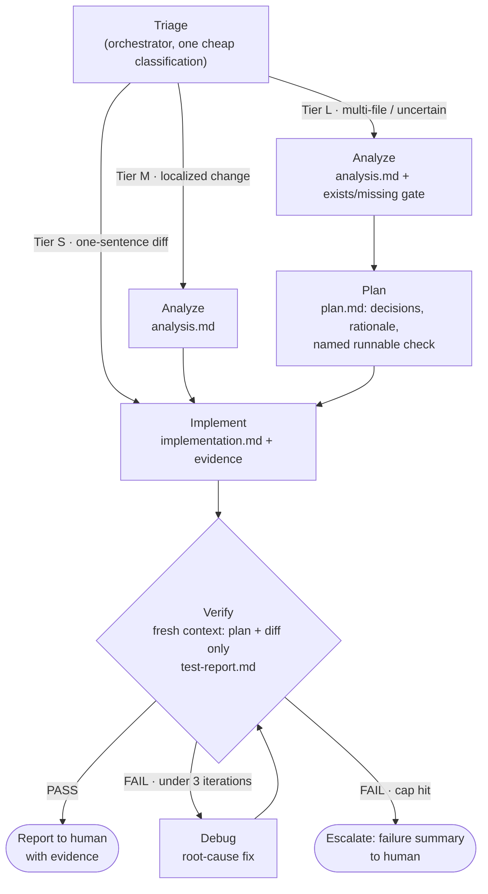

# agent-loop

A staged loop for coding agents: **triage → analyze → plan → implement → verify → debug**, with
file-based handoff and hard iteration caps.

Built as a single [Agent Skills](https://agentskills.io) folder, so it runs in Claude Code, Codex,
Cursor, Gemini CLI, GitHub Copilot, VS Code, OpenCode, Amp, Roo Code, Kiro, Factory and 30+ other
clients — no per-tool rewrite. Generic about your project too: on first run it discovers your
test/build/lint commands and conventions, so the same stages work on any codebase.

## How it works



- **Triage** sizes the ceremony: a one-sentence fix skips analysis and planning entirely.
- Each stage gets a **fresh context** and hands off through markdown artifacts in `.agent-loop/`
  (gitignored — they double as an audit log).
- The **verifier never sees the implementer's reasoning** and cannot edit code: it can only report,
  not rubber-stamp.
- The **debug loop is capped at 3 iterations**, then escalates to you with a failure summary.

## Install

```sh
git clone <this-repo-url> && cd agent-loop
./install.sh claude-code     # or: codex · cursor · agents
```

`agents` targets `.agents/skills/`, the shared convention several tools read. Add `--global` to
install for your user instead of the current project, or `--target <dir>` for anything else. Any
other Agent Skills client: copy `skills/agent-loop/` into its skills directory — see
[adapters/README.md](adapters/README.md) for the per-host table.

Claude Code can also run it with no install at all:

```sh
claude --plugin-dir path/to/agent-loop
```

## Use

```
/agent-loop add rate limiting to the upload endpoint
```

The loop states its tier and execution mode up front, runs the stages, and reports back with the
verdict, the diff summary, and where the evidence lives.

## Portability

The loop needs four things every coding agent has: read files, write files, run shell commands,
search code. Everything beyond that is optional and degrades explicitly rather than silently:

| Capability | With it | Without it |
|---|---|---|
| Subagents | **Mode A** — one isolated context per stage | **Mode B** — stages run in sequence, still reading only their declared inputs |
| Per-agent tool restriction | Verifier spawned with no write tools — it *cannot* patch what it judges | Diff fingerprinted before/after verification; verdict voided if the tree moved |
| Turn caps | Debugger bounded mechanically | Iteration counting; the 3-iteration loop cap holds either way |

The run declares which mode it chose, so you always know which guarantees are structural on your
platform and which are behavioural. Full matrix in
[`references/capabilities.md`](skills/agent-loop/references/capabilities.md).

Shell execution is the one hard requirement. A loop whose verification cannot run real commands has
no termination condition, and would produce confident unverified output — the exact failure the
design exists to prevent.

## Token & context economics

- **Nothing loads until invoked** — the skill is explicit-invocation only, so it costs zero context
  in normal sessions.
- **Isolated stage contexts** — heavy exploration, diffs, and test logs never enter the main
  window; the orchestrator holds only file paths and 10-line stage summaries.
- **Triage tiers** — trivial tasks run two stages, not five (full multi-agent pipelines cost ~15×
  a single chat; most tasks shouldn't pay that).
- **Progressive disclosure** — stage contracts and templates live in `references/` and load only
  when that stage runs.
- **Cached project profile** — commands and conventions are discovered once, verified by executing
  them, and reused across every run from `.agent-loop/profile.md`.
- **Budgets and caps** — per-stage tool-call budgets, a turn cap on the debugger, and a hard
  3-iteration debug loop stop runaway spend.

## Layout

```
skills/agent-loop/          the product: one portable Agent Skill
  SKILL.md                  orchestration protocol — triage, gates, caps, escalation
  references/
    capabilities.md         host capability matrix and degradation rules
    stages/*.md             the six stage contracts (input → output), vendor-neutral
    templates/*.md          artifact contracts each stage must follow
agents/                     optional native subagent definitions, for hosts that support them
adapters/                   per-host install notes and an AGENTS.md snippet
docs/design.md              design decisions and rationale
install.sh                  installs the skill into a host's skills directory
```

See [docs/design.md](docs/design.md) for why each piece is shaped the way it is.
