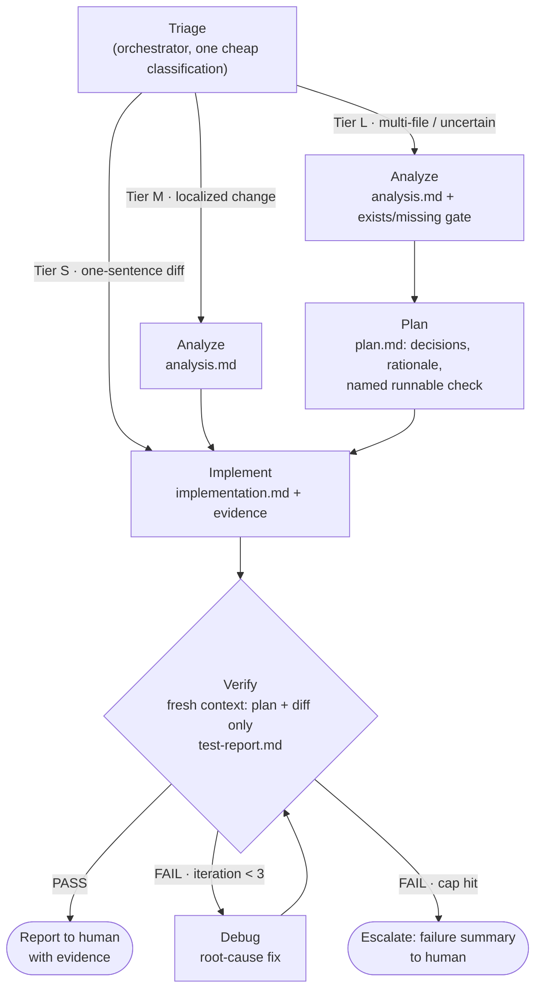

# claude-agent-loop

A staged agent loop for Claude Code: **triage → analyze → plan → implement → verify → debug**, with file-based handoff and hard iteration caps. Generic by design — on first run it discovers your project's test/build/lint commands and conventions, so the same five agents work on any codebase.

## How it works



- **Triage** sizes the ceremony: a one-sentence fix skips analysis and planning entirely.
- Each stage runs in a **fresh subagent context** and hands off through markdown artifacts in `.agent-loop/` (gitignored — they double as an audit log).
- The **verifier has no edit tools** and never sees the implementer's reasoning: it can only report, not rubber-stamp.
- The **debug loop is capped at 3 iterations**, then escalates to you with a failure summary.

## Install

Copy into your project:

```sh
git clone <this-repo-url>
cp -r claude-agent-loop/agents claude-agent-loop/skills claude-agent-loop/templates your-project/.claude/
```

Or just tell Claude Code: *"Set up the agent loop from `<this-repo-url>` in this project."*

Or run it as a plugin without copying anything:

```sh
claude --plugin-dir path/to/claude-agent-loop
```

## Use

```
/agent-loop add rate limiting to the upload endpoint
```

The loop states its tier decision up front, runs the stages, and reports back with the verdict, the diff summary, and where the evidence lives.

## Token & context economics

The loop is built to keep context windows small and token spend proportional to task size:

- **Nothing loads until invoked** — the skill sets `disable-model-invocation`, so it costs zero context in normal sessions.
- **Isolated stage contexts** — heavy exploration, diffs, and test logs never enter the main window; the orchestrator holds only file paths and 10-line stage summaries.
- **Triage tiers** — trivial tasks run two stages, not five (full multi-agent pipelines cost ~15× a single chat; most tasks shouldn't pay that).
- **Cached project profile** — commands and conventions are discovered once, verified, and reused across every run from `.agent-loop/profile.md`.
- **Budgets and caps** — per-stage tool-call budgets, a `maxTurns` cap on the debugger, and a hard 3-iteration debug loop stop runaway spend.

## Layout

```
agents/       five stage agents: analyzer, planner, implementer, verifier, debugger
skills/       the /agent-loop orchestrator
templates/    artifact contracts each stage must follow
docs/         design decisions and rationale
```

See [docs/design.md](docs/design.md) for why each piece is shaped the way it is.
